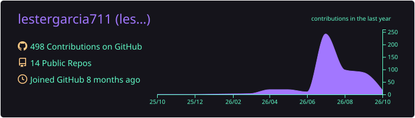
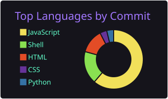
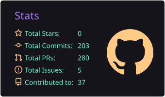

  

---

## Sobre mí

Soy **Técnico en Desarrollo de Software** con enfoque en el **frontend** (páginas web con HTML, CSS y JavaScript) y en el **backend** con **Python** y bases de datos **MySQL**.

Durante mi formación en **Campuslands** he desarrollado proyectos académicos y personales, trabajando con **Visual Studio Code** y control de versiones con **Git y GitHub**.

Actualmente:
- 🌱 Aprendiendo: NODEJS ...

## 🛠️ Stack tecnológico

  

 

| Área | Tecnologías |
|:---|:---|
| **Frontend** | HTML, CSS, JavaScript |
| **Backend** | Python, JavaScript, TypeScript |
| **Bases de datos** | MySQL |
| **Herramientas** | Git, GitHub, Visual Studio Code, Docker |

##  Proyectos destacados

| Proyecto | Qué resuelve | Tecnologías | Demo |
|:---|:---|:---|:---:|
| **Campus Shop Online** Tienda de ropa en línea | Facilita la venta de ropa por internet y la actualización de nuevos productos para atraer más clientes. | `HTML` `CSS` | [Ver demo](https://lestergarcia711.github.io/campus-shop-online/) |
| **Sistema Campus Parking** Gestión de parqueadero | Mejora el servicio al cliente, evita la pérdida de datos y agiliza el manejo de la información. | `HTML` `CSS` `JavaScript` | [Ver demo](https://lestergarcia711.github.io/sistema-campus-parking/) |

## 📊 Actividad en GitHub

    

  
  

  

##  Cómo trabajo

- No trabajo directamente sobre `main`; uso ramas separadas por responsabilidad.
- Organizo las carpetas del proyecto con criterio.
- Documento cada integración o modificación.
- Escribo commits claros y profesionales, en infinitivo.
- Integro los cambios mediante Pull Requests.

---

📫 **lestergarcia711@gmail.com** · 🌐 [Portafolio](https://lestergarcia711.github.io/portafolio-lester/) · 💼 [LinkedIn](https://www.linkedin.com/in/lester-garcia-dev/)

¿Tienes una idea o una oportunidad? Escríbeme, con gusto conversamos.

